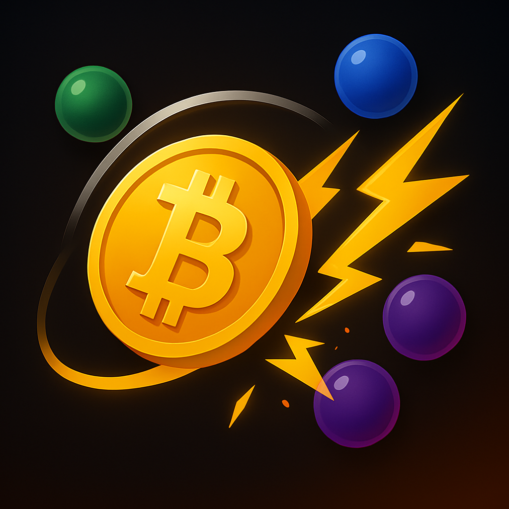

  
  <h1>No2ndBest</h1>

A Bitcoin-themed iOS arcade game created with SpriteKit where players destroy altcoin bubbles with lightning attacks.

## Description

"There is no second best"

No2ndBest is a fast-paced Bitcoin-themed mobile game that challenges players to tap in rhythm with a moving target while launching lightning attacks to destroy altcoin bubbles. The game's name and philosophy are inspired by the famous Bitcoin maxim: "There is no second best."

## Features

- **Multi-Lightning Attack System**: Successfully tap the target to trigger multiple simultaneous lightning strikes that destroy 4-9 altcoin bubbles at once
- **Diverse Crypto Bubbles**: Features 30+ different cryptocurrency symbols floating around the Bitcoin central circle
- **Bitcoin Dominance Meter**: Track Bitcoin's market dominance as you play
- **Bitcoin Wisdom**: Famous Bitcoin maximalist quotes appear when bubbles pop
- **Rich Visual Effects**: Smooth animations with fluid ball movement, colorful explosion particles, and shimmering bubble effects
- **Two-Finger Support**: Play with up to two fingers for advanced gameplay

## Gameplay

1. Tap the screen to start the game
2. Time your taps to hit the moving target at the top of the screen
3. When you successfully tap, multiple lightning bolts will strike several altcoin bubbles simultaneously
4. Destroy all altcoin bubbles to progress and increase your score
5. Watch for Bitcoin wisdom quotes with each successful hit

## Requirements

- Xcode 14.0+
- iOS 15.0+
- Swift 5.0+

## Installation

1. Clone this repository
2. Open No2ndBest.xcodeproj in Xcode
3. Build and run the project

## Inspiration

This game was inspired by the Bitcoin maximalist philosophy, particularly the famous maxim "There is no second best" about Bitcoin's unique position in the cryptocurrency space.

## Features Recently Added

- Enhanced Bitcoin-themed main menu with glowing effects
- Increased bubble density with 30+ unique cryptocurrency bubbles on screen
- Optimized explosion effects with adaptive performance scaling
- Improved game performance with reduced lag during multiple simultaneous explosions
- Simplified visual elements for smoother gameplay on all devices
- Shimmering effect on all cryptocurrency bubbles
- Sequential display of Bitcoin wisdom quotes

## Future Plans

- Additional power-ups and gameplay mechanics
- Leaderboard integration
- Achievement system
- Bitcoin Lightning Network integration

## License

This project is licensed under the MIT License - see the LICENSE file for details.
